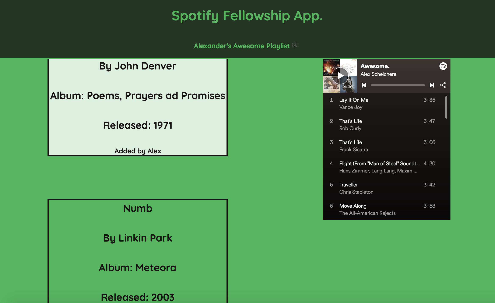

# Greetings!

I made this repository for my Spotify Fellowship application. I'll answer each technical question in it's own file. I'll be using JavaScript to solve these questions.

You may navigate to the questions from here:

| Question | Link                                                                                                  |
| -------- | ----------------------------------------------------------------------------------------------------- |
| 1        | [Sort By String](https://github.com/Lexscher/Spotify_Fellowship_Questions/blob/master/js/Q1.js)       |
| 2        | [Decode Strings](https://github.com/Lexscher/Spotify_Fellowship_Questions/blob/master/js/Q2.js)       |
| 3        | [Change Possibilities](https://github.com/Lexscher/Spotify_Fellowship_Questions/blob/master/js/Q3.js) |

Okay, I made a little page about one of my playlists. You can see it [_here_](https://lexscher.github.io/Spotify_Fellowship_Questions/). I had a lot of fun with this.
If you aren't a fan of links, here's a screenshot:

---

##### Thank you for taking an interest in my code.

### Best,

## Alexander
